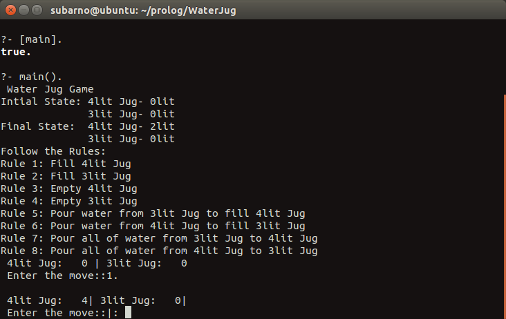
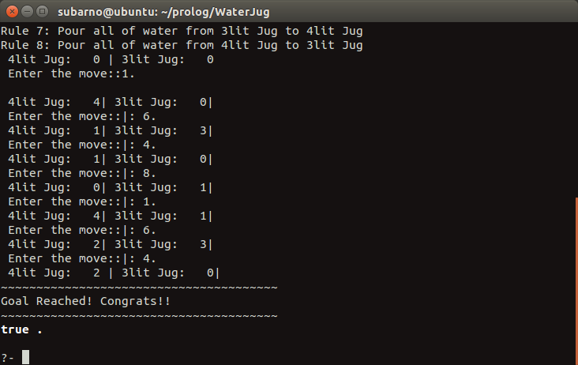

# WaterJugGame

A Water Jug Problem: You are given two jugs, a 4lit one and a 3lit
one, a pump which has unlimited water which you can use to  fill the jug, and
the ground on which water may be poured. Neither jug has any measuring
markings on it. How can you get exactly 2lit of water in the 4lit jug?

### Reqirements
* SWI-Prolog version 7.2.0

### Basic Usage

```
$ swipl
?- [main].
?- main().
```
### Results

||

||


### References

* Water Jug Problem (https://www.eecis.udel.edu/~mccoy/courses/cisc4-681.10f/lec-materials/handouts/search-water-jug-handout.pdf)
